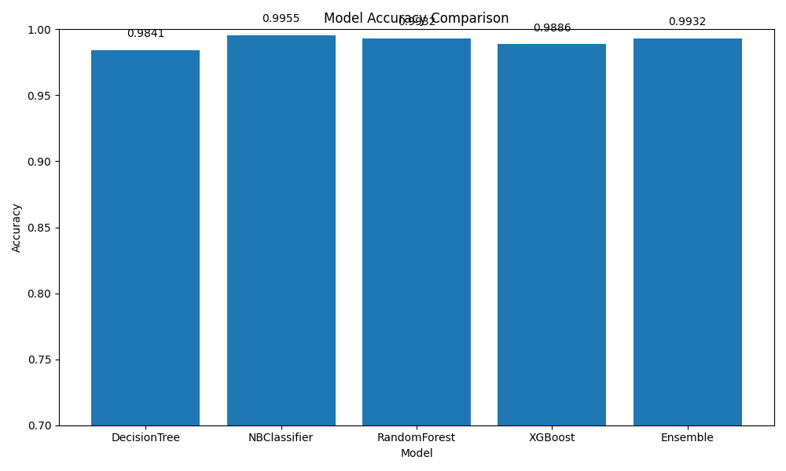

# Soil Intelligence Crop Recommendation Models



This repository contains pre-trained machine learning models for crop recommendation based on soil and environmental factors. The models are trained using the **Crop Recommendation Dataset**, which is included in this repository.

## Dataset
The dataset (`Crop_recommendation.csv`) consists of the following features:
- **N**: Nitrogen content in the soil
- **P**: Phosphorus content in the soil
- **K**: Potassium content in the soil
- **temperature**: Temperature in degrees Celsius
- **humidity**: Relative humidity percentage
- **ph**: pH value of the soil
- **rainfall**: Annual rainfall in mm
- **label**: Recommended crop (target variable)

## Models
The following machine learning models have been trained and saved in the `models/` and `Advance_models/` directories:

### Basic Models (`models/`)
| Model Name          | Description |
|--------------------|-------------|
| `DecisionTree.pkl`  | Decision Tree Classifier |
| `NBClassifier.pkl`  | Naïve Bayes Classifier |
| `RandomForest.pkl`  | Random Forest Classifier |
| `XGBoost.pkl`      | XGBoost Classifier |
| `label_map.pkl`    | Label encoding mapping |

### Advanced Models (`Advance_models/`)
| Model Name          | Description |
|--------------------|-------------|
| `DecisionTree.pkl`  | Advanced Decision Tree Classifier |
| `NBClassifier.pkl`  | Improved Naïve Bayes Classifier |
| `RandomForest.pkl`  | Optimized Random Forest Classifier |
| `XGBoost.pkl`      | Fine-Tuned XGBoost Classifier |
| `Ensemble.pkl`     | Ensemble Model (combination of classifiers) |
| `label_map.pkl`    | Label encoding mapping |

## Model Performance
Detailed model performance metrics, including confusion matrices and feature importance, are available in the `Advance_models/scores_img/` directory.

## Usage
These models can be loaded and used for inference in Python using the `joblib` library:

```python
import joblib
import pandas as pd

# Load model
model = joblib.load('Advance_models/RandomForest.pkl')

# Load label mapping
label_map = joblib.load('Advance_models/label_map.pkl')
reverse_label_map = {v: k for k, v in label_map.items()}

# Example input (replace with real data)
sample_input = pd.DataFrame([[90, 42, 43, 20.87, 82.02, 6.5, 202.93]],
                            columns=['N', 'P', 'K', 'temperature', 'humidity', 'ph', 'rainfall'])

# Predict
prediction = model.predict(sample_input)
predicted_crop = reverse_label_map[prediction[0]]
print("Recommended Crop:", predicted_crop)
```

## Repository Structure
```
Soil-Intel-Crop-Models/
│── models/
│   ├── DecisionTree.pkl
│   ├── NBClassifier.pkl
│   ├── RandomForest.pkl
│   ├── XGBoost.pkl
│   ├── label_map.pkl
│── Advance_models/
│   ├── DecisionTree.pkl
│   ├── NBClassifier.pkl
│   ├── RandomForest.pkl
│   ├── XGBoost.pkl
│   ├── Ensemble.pkl
│   ├── label_map.pkl
│   ├── scores_img/
│       ├── DecisionTree_confusion_matrix.png
│       ├── DecisionTree_feature_importance.png
│       ├── model_comparison.png
│       ├── NBClassifier_confusion_matrix.png
│       ├── RandomForest_confusion_matrix.png
│       ├── RandomForest_feature_importance.png
│       ├── XGBoost_confusion_matrix.png
│       ├── XGBoost_feature_importance.png
│── Crop_recommendation.csv
│── README.md
│── LICENSE
```

## License
This repository is open for educational and research purposes. Feel free to use and modify it as needed.

## Contributors
- **Ben** - [GitHub](https://github.com/ben041/)
- **BrianOverkill** - [GitHub](https://github.com/BrianOverkill)

## Acknowledgment
Dataset Source: **Crop Recommendation Dataset**
